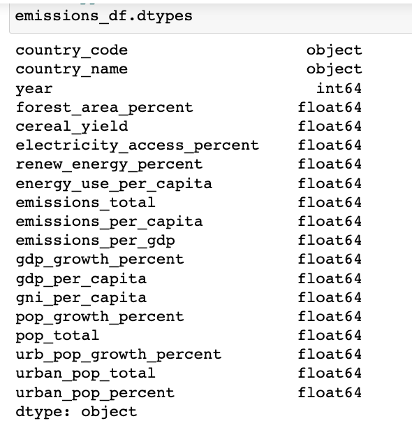

Machine_Learning_Model
# Emissions Machine Learning Model

## Data Extraction:

- Datasets from [Climate TRACE](https://climatetrace.org/) are downloaded. After exploring the data, this dataset is not considered due to lack of dependent features that can address the project's outcome.
- Later, World Bank climate change data is downloaded to train the model. Though, there are several ways to retrieve the dataset, Python's wbgapi API is used due to the ease of data retrieval and availability of current data.

## Data Cleaning

- Basic cleaning is done on the dataset to remove empty values.
- The data is then loaded into a local PostGres database.

## Emissions Model Creation:

- The data retrieved from the local PostGres database is considered as initial data set for the model. The dataset has 7182 rows and 17 columns.

- With 17 columns to explore, the variables involved are classified as dependent and independent variables.
- Dependent Variables
  - emissions_total
  - emissions_per_capita
  - emissions_per_gdp
- Variables to drop: year, country_name, country_code
- The rest are considered as independent variables.

### Exploratory Data Analysis

- Since there are multiple independent variables that may predict emissions, a **Correlation** matrix is generated to reduce and interpret data.
- **CO2 emissions_per_capita is considered target variable** as this is correlated to several predicting variables.
- A correlation value of 0.5 is set as threshold to select the features: Energy use per capita, GDP per capita, Urban Population %, Electricity Access %, Cereal Yield 
- Later, each selected feature is visualized with the target variable. CO2 emissions per capita shows a strong linear dependency to Energy use per capita and non-linear relationships with rest of the features.
- Since majority of features exhibit non-linear relationship with target variable, Machine Learning algorithms that can handle non-linearities are chosen.

	
               
- How are you training your model?
-   training and testing sets
		.	The training and testing data are split in 70:30 ratio. 
     
- 
- What is the model's accuracy?
- How does this model work?
=======
# Working Title: Predicting and Analyzing Greenhouse Gas Emmissions

## Project Overview
The damage caused by climate change over this past year was at times so immense it was hard to comprehend. In Pakistan alone, extreme summer flooding killed thousands, displaced millions and caused over $40 billion in losses. Fall floods in Nigeria killed hundreds and displaced over 1 million people. Droughts in Europe, China and the U.S. dried out once-unstoppable rivers and slowed the flows of commerce on major arteries like the Mississippi and the Rhine.

As 2022 unfolded, a clear pathway of climate hope emerged. New policy breakthroughs have the potential to unlock enormous progress in the effort to slow and reverse warming temperatures. Encouraging developments from a very momentous year, as nation after nation elected more climate-oriented governments and enacted new efforts to curb greenhouse gas. in August the Biden administration and a narrow Democratic majority in Congress managed to pass the Inflation Reduction Act. 

This new U.S. law, backed by some $374 billion in climate spending, is the country's most aggressive piece of climate legislation ever. Its provisions ensure that for decades to come billions of dollars will roll toward the energy transition, making it easier to deploy renewable energy, build out green technologies and subsidize consumer adoption of everything from electric cars to heat pumps. Experts on energy modeling predict the law will eliminate 4 billion tons of greenhouse gas emissions.

For our project, we have an investor that would like to tap into the climate spending but doesn't know what sector or location to start. We will be utilizing the Climate Change Data from the World Bank for our database. It is data from World Development Indicators and Climate Change Knowledge Portal on climate systems, exposure to climate impacts, resilience, greenhouse gas emissions, and energy use. We will be using a machine learning model for predicting CO2 greenhouse gas emissions from economic growth indicatiors like Gross Domestic Product (GDP), population, and energy use per capita. We will be analyzing greenhouse gas emissions by the following:
- Per capita: how much CO2 does the average person emit?
- What are the countries’ annual CO2 emissions?
- Year-on-year change: what is the percentage change in CO2 emissions?
- Cumulative: how much CO2 has it produced to date?
- What share of global CO2 emissions are emitted by the country?
- Total greenhouse gas emissions: how much does the average person emit? Where do emissions come from? 
- Does energy used to sustain a person in a country have an effect on CO2 emissions? 
- How does GDP influence Co2 emissions? 
- How does Urban population in a country affect CO2 emissions?

## Communication protocols
We are utilizing our Slack group project channel to relay information to each other. We have divided the project by presentation, GitHub, Machine Learning Model, Database and Dashboard. We created branches for each deliverable and will use that branch for our portion of the project. When we are ready for pull requests to be approved, we will indicate via Slack that we are ready for the person in charge of Github to act accordingly. We are meeting 3 times a week to collaborate and ensure we are answering each others' questions. 

## Project Outline
- <b>Presentation: </b>
  - Content 
    - Selected topic
    - Reason why they selected their topic
    - Description of their source of data
    - Questions they hope to answer with the data
    - Description of the data exploration phase of the project
    - Description of the analysis phase of the project
    - Technologies, languages, tools, and algorithms used throughout the project 
    - Result of analysis
    - Recommendation for future analysis
    - Anything the team would have done differently
  - Google Slides: 
    - Presentations are finalized in Google Slides
  - Live Presentation
    - All team members present in equal proportions 
    - The team demonstrates interactivity of dashboard in real time 
    - The presentation falls within any time limits provided by instructor 
    - Submission includes speaker notes, flashcards, or a video of the presentation rehearsal
- <b>Github:</b>
  - Main Branch
    - All code necessary to perform exploratory analysis
    - All code necessary to complete machine learning portion of project 
    - Any images that have been created (at least three)
    - Requirements.txt file
  - README.md
    - Cohesive, structured outline of the project (this may include images, but should be easy to follow and digest)
    - Link to dashboard (or link to video of dashboard demo)
    - Link to Google Slides presentation
  - Individual Branches
    - At least one branch for each team member
    - Each team member has at least four commits for the duration of the final segment (16 total commits per person)
- <b>Machine Learning Model: Working code or their machine learning model</b>
  - Description of data preprocessing 
  - Description of feature engineering and the feature selection, including the team's decision-making process 
  - Description of how data was split into training and testing sets
  - Explanation of model choice, including limitations and benefits
  - Explanation of changes in model choice (if changes occurred between the Segment 2 and Segment 3 deliverables)
  - Description of how model was trained (or retrained, if they are using an existing model)
  - Description and explanation of model’s confusion matrix, including final accuracy score 
- <b>Database: Present a final project with a fully integrated database</b>
  - Database stores static data for use during the project
  - Database interfaces with the project in some format (e.g., scraping updates the database, or database connects to the model)
  - Includes at least two tables (or collections, if using MongoDB)
  - Includes at least one join using the database language (not including any joins in Pandas) 
  - Includes at least one connection string (using SQLAlchemy or PyMongo)
- <b>Dashboard: </b>
  - Images from the initial analysis
  - Data (images or report) from the machine learning task
  - At least one interactive element

## Resources
- Data Source: <a href="https://datacatalog.worldbank.org/search/dataset/0040205">Climate Change Data | Data Catalog</a>
- Software: Jupyter Notebook 6.4.8, Python 3.7.13, Tableau Public 2022.3.0
- Library: WBGAPI
- Overview Source: <a href="https://www.stltoday.com/news/world/six-climate-breakthroughs-that-made-2022-a-step-toward-net-zero/article_b87f90e9-0945-56e9-ba52-0e1c053198eb.html"> Six climate breakthroughs that made 2022 a step toward net zero</a> by Leslie Kaufman and Laura Millan Lombrana and <a href="https://ourworldindata.org/co2/country/united-states?country=USA~CHN~JPN~DEU">United States: CO2 Country Profile</a> by Hannah Ritchie and Max Roser

##  Results
### Data Collection  
We used a python library(wbgapi) that fetches World Bank Data directly into the dataframe using API. 

### Data Cleaning and Analysis
Pandas is used to clean the data and perform an exploratory analysis.

### Database Storage
Postgres(SQL) is the database we intend to use, and the structure of the database is designed using the QuickDBD tool. We will eventually run the database in AWS.

The ERD diagram is shown below,

* Database stores static data for use during the project.

* Database interfaces with the project in some format (database connects to the model)

### Data Extraction:

- Datasets from [Climate TRACE](https://climatetrace.org/) are downloaded. After exploring the data, this dataset is not considered due to lack of dependent features that can address the project's outcome.
- Later, World Bank climate change data is downloaded to train the model. Though, there are several ways to retrieve the dataset, Python's wbgapi API is used due to the ease of data retrieval and availability of current data.

### Data Cleaning

- Basic cleaning is done on the dataset to remove empty values.
- The data is then loaded into a local PostGres database.

### Emissions Model Creation:

- The data retrieved from the local PostGres database is considered as initial data set for the model. The dataset has 3552 rows and 19 columns.

- With 19 columns to explore, the variables involved are classified as dependent and independent variables.
- Dependent Variables
  - emissions_total
  - emissions_per_capita
  - emissions_per_gdp
- Variables to drop: year, country_name, country_code
- The rest are considered as independent variables.

### Exploratory Data Analysis

- Since there are multiple independent variables that may predict emissions, a **Correlation** matrix is generated to reduce and interpret data.
- **CO2 emissions_per_capita is considered target variable** as this is correlated to several predicting variables.
- A correlation value of 0.5 is set as threshold to select the features: Energy use per capita, GDP per capita, GNI per capita, Urban Population %, Electricity Access %, Cereal Yield 
- Later, each selected feature is visualized with the target variable. CO2 emissions per capita shows a strong linear dependency to Energy use per capita and non-linear relationships with rest of the features.
- Since majority of features exhibit non-linear relationship with target variable, Machine Learning algorithms that can handle non-linearities are chosen.

- Data preprocessing
		.Unnecessary columns (like country)are dropped from the retrieved data.
		 
	        . Address the skew by cuberrot transformer on positively skewd values
          . Address the skew by cuberrot transformer on negetively skewed values
          . Remove null values

- How are you training your model?
- training and testing sets
		.	The training and testing data are split in 70:30 ratio. 
    . Emissions per capita is considered as target variable out of three Dependent variables.
    . The rest are considered as independent variables.
    
- Feature Engineering
		•	The model tests the hypothesis whether CO2 emissions depend on  energy use, population metrics, GDP, cereal yield, etc.  available in the dataset and can be predicted from these.
  		.	The dataset has three dependent variables that predict emissions.
		.	Upon plotting correlation matrix, emissions_per_capita is chose as label as this is correlated to many independent variables.
    
   .Emissions per capita is highly impacted by enery use per capita.
    
- Explanation of model choice, including limitations and benefits

	 .CO2 emissions per capita shows both linear dependency and non-linear relationships with features plotted.
        .Since features exhibit both linear and non-linear relationship with CO2 emissions per capita, Machine Learning algorithms that can handle non-linearities like DecisionTreeRegressor and RandomForestRegressor will be trained can be used.

       .A Random Forest Regression model is powerful and accurate. It usually performs great on many problems, including features with non-linear relationships. Disadvantages, however, include the following: there is no interpretability, overfitting may easily occur, we must choose the number of trees to include in the model.

	.	◦	Decision Tree is a Supervised learning technique that can be used for both classification and Regression problems, but mostly it is preferred for solving Classification problems. It is a tree-structured classifier, where internal nodes represent the features of a dataset, branches represent the decision rules and each leaf node represents the outcome.
  
  Explanation of changes in model choice (if changes occurred between the Segment 2 and Segment 3 deliverables)

	Implemented Hyper-parameter tuning in Segment 3 to optimize the ML model. 

 To fit a machine learning model into different problems, its hyper-parameters must be tuned. Selecting the best hyper-parameter configuration for machine  learning models has a direct impact on the model's performance.

 .Grid Search approach have been implemented for HPT:
	Grid search is the simplest algorithm for hyper-parameter tuning (HPT). Basically, it divides the domain of the hyper-parameters into a discrete grid. Then, try every combination of values  of this grid, calculating some performance metrics using cross-validation. The point of the grid that maximizes the average value in cross-validation, is the optimal combination of values for the hyper-parameters.
  
  .Also, implemented algorithm for Support Vector Machine(SVM) and K-NearestNeighbors(KNN) to cross validate the model.
  
  ✓ Description of how they have trained themodel thus far, and any additional training that will take place
	 
	After Hyper-Parameter Tuning, it is observed that the model  trained has not much improvement in the model .    
 
   
- What is the model's accuracy?

## *Pending* Link to the Dashboard
[link to Tableau dashboard] <a href="">link to dashboard</a>

## *Pending* Link to the Presentation
[link to Google Slides Presentation] <a href="">link to presentation</a>

## *Pending* Summary and Recommendations

