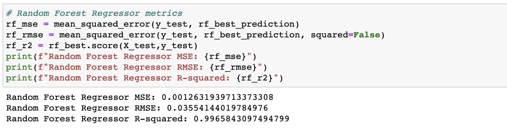

# Predicting Greenhouse Gas Emissions with Machine Learning and Data Analysis

## Project Overview
As 2022 unfolded, a clear pathway of climate hope emerged. New policy breakthroughs have the potential to unlock enormous progress in the effort to slow and reverse warming temperatures. In August 2022, the Biden administration managed to pass the Inflation Reduction Act. This new U.S. law, backed by some $374 billion in climate spending, is the country's most aggressive piece of climate legislation ever. For decades to come billions of dollars will roll toward the energy transition, making it easier to deploy renewable energy, build out green technologies and subsidize consumer adoption of everything from electric cars to heat pumps. Experts on energy modeling predict the law will eliminate 4 billion tons of greenhouse gas emissions.

For our project, we have an investor that would like to tap into the climate spending but doesn't know what sector or location to start. We will be utilizing the Climate Change Data from the World Bank for our database. We will be using machine learning algorithms to predict CO2 greenhouse gas emissions from economic growth indicatiors like Gross Domestic Product (GDP), population, and energy usage. We will be analyzing greenhouse gas emissions by the following:

- General
  - What countries have the largest CO2 greenhouse gas emissions (GHG)?
  - What are the GHG emissions per country?
- Machine Learning: 
  - Can a machine learning model show that there is a correlation between factors that may influence CO2 emissions?
- Factors influencing emissions: 
  - How does CO2 emissions change year over year?
  - How does GDP influence CO2 emissions? 
  - How does population influence CO2 emissions? 
- USA Data: 
  - Which state and city has the most CO2 emissions?
  - What sector generates the most CO2 emissions?
  - What cities contribute to the CO2 emissions' sectors?

## Resources
- Data Source: [Climate Change Data | Data Catalog](https://datacatalog.worldbank.org/search/dataset/0040205), [Climate Watch](https://www.climatewatchdata.org/data-explorer/historical-emissions?historical-emissions-data-sources=climate-watch&historical-emissions-gases=all-ghg&historical-emissions-regions=All%20Selected&historical-emissions-sectors=total-including-lucf%2Ctotal-including-lucf&page=1), [Emissions by Unit and Fuel Type|US EPA](https://www.epa.gov/ghgreporting/data-sets), [countries.csv](https://github.com/sahithig1/capstone_greenhouse_emissions/blob/main/Resources/countries.csv), [ghg_emissions.csv](https://github.com/sahithig1/capstone_greenhouse_emissions/blob/main/Resources/ghg_emissions.csv), [USA_CO2_data.csv](https://github.com/sahithig1/capstone_greenhouse_emissions/blob/presentation/Resources/USA_CO2_data.csv)
- Software: Jupyter Notebook 6.4.8, Python 3.7.13, Tableau Public 2022.3.0, PostgreSQL, Flask 1.1.2, HTML5, CSS, Bootstrap 3.3.7, D3, Plotly 5.9.0
- Library: Pandas, Matplotlib, Numpy, Seaborn, WBGAPI
- Overview Source: [Six climate breakthroughs that made 2022 a step toward net zero by Leslie Kaufman and Laura Millan Lombrana](https://www.stltoday.com/news/world/six-climate-breakthroughs-that-made-2022-a-step-toward-net-zero/article_b87f90e9-0945-56e9-ba52-0e1c053198eb.html), [United States: CO2 Country Profile by Hannah Ritchie and Max Roser](https://ourworldindata.org/co2/country/united-states?country=USA~CHN~JPN~DEU)

##  Results

### Data Extraction and Storage

- The data for the project is extracted from the World bank database. Though, there are several ways to retrieve the dataset, Python’s WBGAPI is chosen because of the ease of data retrieval and availability of current data.
- Pandas is used to clean the data and perform exploratory data analysis. The data is then loaded into PostGreSQL AWS RDS instance. 
- The structure of the database is designed using the QuickDBD tool.

#### The ERD diagram is shown below:

#### Database stores static data for use during the project.

#### SQL Joins

#### Database interfaces with the project (database connects to the model)

### Machine Learning

- The model tests the hypothesis whether CO2 emissions can be predicted from country-specific features (such as population metrics, GDP, fossil use, etc. ) available in the dataset.

#### Data Preprocessing
- The model connects to AWS RDS instance to get data.
- Largely skewed columns are handled by a cuberoot transform to achieve a fairly symmetric distribution.
- emissions_per_capita is the label for the model.
- Correlation matrix is plotted to identify strongly correlated features w.r.to emissions_per_capita.
- Scatter plots are used to show the distribution of features with label. Since all features show non-linear relation with emissions_per_capita, Machine Learning algorithms that can handle non-linearities like DecisionTreeRegressor and RandomForestRegressor are trained.

#### Training and Hyper Parameter Tuning
- The training and testing data are split in 67:33 ratio.
- Grid Search algorithm is implemented on both models to determine hyper parameters.
- Decision Tree Regressoe did not show improvement upon hyper parameter tuning.
- Randomized Search algorithm is also implemented on Random Forest Regressor.
- The best parameters are used to train the models to record RMSE. The details are shown below:
<table>
	<tr>
		<td></td>
		<td></td>
	</tr>
</table>

## Link to the Dashboard
[Link to the Heroku Dashboard](https://ghflask.herokuapp.com/)

[Link to the Tableau Workbook](https://public.tableau.com/app/profile/soumya.abraham/viz/Capstone_Project_16739069678420/Capstone_Project)

[Link to the Excel Dashboard Blueprint](https://github.com/sahithig1/capstone_greenhouse_emissions/blob/Visualization/Visualization%20Tracker.xlsx)

## Dashboard
In the Heroku Dashboard, you will find the following:
- The web application has a header image and navigation bar with several tabs. Upon clicking the navigation links, the user is directed to visual analysis.
- The Home tab gives an overview of Greenhouse Gases and their emissions with various visuals to help grasp concepts better.  
- The Model will summarize the prediction of Machine Learning algorithms used in the project.
- The Factors tab employs interactivity with radio buttons that allow selection of a factor that can influence emissions.
- The USA tab dives into the CO2 emissions within the country. 
	- We have a map on the left showcasing the CO2 emissions within each city and state. A dropdown filter allows you to choose specific cities the investor may be interested in. This can be useful when you want to declutter the map to provide emissions in specific state(s).
	- The bar graph on the right shows the CO2 emissions per state, sorted in descending order. You will notice that Texas has the highest CO2 emissions of all. 
	- A second bar graph is placed at the bottom of the page, where we can see the various sectors, each divided by state and city.
If you click on the TX bar, you will notice only the cities in TX will be highlighted in the sector bar graph.

In the Excel Dashboard Blueprint, you will find the following:
- Description of the tools used for the final dashboard
- Description of the interactive element
- Analysis for the visualizations
- Future visualization ideas and recommendations for improving current visualization

## Link to the Presentation
[link to Google Slides Presentation](https://docs.google.com/presentation/d/e/2PACX-1vS_3j0Or_IGgdZwBIAsJDioPNrLeFdTmpARP94NagTTQFHqumSYEkyejG5D58UHU30W4D99TDhUWuLx/pub?start=false&loop=false&delayms=3000)

## Summary and Recommendations for the Dashboard
### Workflow: 
The cleaned data from the database is used to create visualizations. The dashboard is an interactive  web application which showcases seamless integration of Tableau and Plotly visuals.

#### Tableau
- After bringing in our CSV files, we chose various forms of graphs and maps to show the relationship between CO2 emissions and various factors such as GDP per capita, population growth, fossil usage, etc. 
- We also used various forms of filtering (by Year, Top 10 countries etc) to allow for a more comprehensive study of the charts provided. 
- We used the Actions option in Tableau Dashboard, to include interactive selection and filtering elements to our visualization.

- Through our dashboard, we will be able to dive into some visualizations to help our investors grasp the concepts of Green House Gas emissions and their effects on the environment. 

=======
#### Plotly:
- HTML, CSS and Bootstrap are extensively used to build the layout of the dashboard page. 
- The dashboard also houses plots built with Python's Plotly.
- The Tableau visualizations are embedded into the web page using Tableau Embedding API. 

#### Analysis 
At first glance, we can see that TX is the largest CO2 emitter in the country, followed by LA. 
When we click on the TX bar in the bar graph, we can see how these emissions are spread out over the various sectors. Chemicals sector is the highest contributor.

We also notice the the Chemical sector is the highest contributing sector for CO2 emission in LA. 

As the first step to our analysis, we can assume that Texas and Louisiana are high on our priority list of states needing assistance in cutting down their CO2 emissions, especially in the Chemicals sector.

We may need to look into the companies that emit the highest amounts of CO2 and see if they would be a good match for this investment goal.

#### Future visualization and improvement: 

- Creating individual dropdown menu for each factor (Energy Use, Urban Population Growth and GDP) in the Factor tab. 

